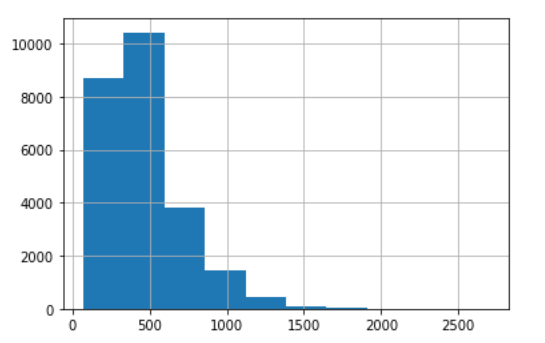

# Sentiment-Analysis-IMDb

### [My LinkedIn](https://linkedin.com/in/mohamed-ilyes-ltifi)

Analysis of 25,000 IMDb reviews and prediction of sentiment as 'positive' or 'negative' using the LongShortTermMemory model, the Keras and TensorFlow libraries + Implemented Hyper Parameter Tuning.

I have also made a Web App to showcase the result model, where you enter text to see if it is positive or negative.
[Link to the application]()

The final accuracy before Hyper Parameter Tuning is:	**91 %**

Hyper Parameter Tuning is nearly complete, but apparently the best possible accuracy will be	**97 %**

## Data Analysis

#### Length of reviews(number of words) x Number

